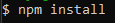
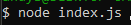

# employee-database

## Description

This project is a CLI application mainly using sql where users can View, Add or Update Employees, Departments and Roles.
The technologies used for this project were mysql, mysql2 and node.js.
The hardest part of this project was trying to implement add and update functions and getting them to work.
A feature I would like to add in the future is a function for deleting an employee from the database.

## Installation

This application is a command line application so to install this application the user will have to download the repository from GitHub and run it locally. This project was made using node.js
v16.20.1 and will be required to run this application, it can be found [here](https://nodejs.org/en/blog/release/v16.20.1).
All the dependencies are listed in the package.json so once Node.js has been installed, you will just have to go (npm install) when you have entered into the local repository in command line.
As shown in the following screenshot:

And be run using the following command:

or

## Usage

Once run the the command line will prompt you with a variety of options to select from including viewing and adding employees, roles and departments as well as updating employees. There is alson an option to exit the command line. An example of how to use the application is shown in the video below:

https://github.com/Andysu7117/employee-database/assets/104291853/b8f607d8-fac3-4d02-b7e4-4988e3fb8e39

